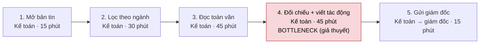

# CP5 — Quy trình hiện tại

Số phút là ước lượng từ Card #1, chưa đo. Tổng 150 phút/tuần có văn bản liên quan, 5/5 bước thủ công.

```mermaid
flowchart LR
  B1["1. Mở bản tin<br/>Kế toán · 15 phút"] --> B2["2. Lọc theo ngành<br/>Kế toán · 30 phút"]
  B2 --> B3["3. Đọc toàn văn<br/>Kế toán · 45 phút"]
  B3 --> B4["4. Đối chiếu + viết tác động<br/>Kế toán · 45 phút<br/>BOTTLENECK (giả thuyết)"]
  B4 --> B5["5. Gửi giám đốc<br/>Kế toán → giám đốc · 15 phút"]
  classDef bottleneck fill:#f8d7da,stroke:#b02a37,color:#000
  class B4 bottleneck
```
