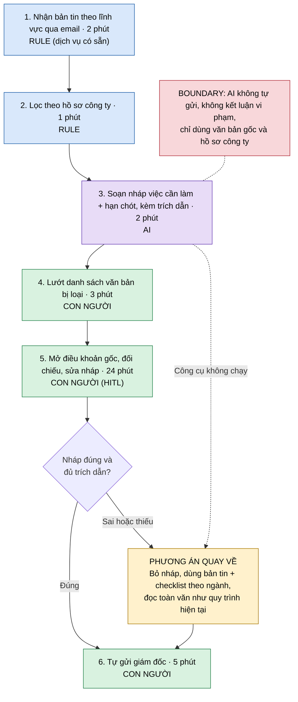

# CP5 — Quy trình tương lai

Số phút là giả định thiết kế, chưa đo. Tổng khoảng 37 phút/tuần có văn bản liên quan, 3/6 bước thủ công.

```mermaid
flowchart TD
  T1["1. Nhận bản tin theo lĩnh vực qua email · 2 phút<br/>RULE (dịch vụ có sẵn)"]:::rule --> T2["2. Lọc theo hồ sơ công ty · 1 phút<br/>RULE"]:::rule
  T2 --> T3["3. Soạn nháp việc cần làm + hạn chót, kèm trích dẫn · 2 phút<br/>AI"]:::ai
  T3 --> T4["4. Lướt danh sách văn bản bị loại · 3 phút<br/>CON NGƯỜI"]:::human
  T4 --> T5["5. Mở điều khoản gốc, đối chiếu, sửa nháp · 24 phút<br/>CON NGƯỜI (HITL)"]:::human
  T5 --> C{"Nháp đúng và<br/>đủ trích dẫn?"}
  C -- Đúng --> T6["6. Tự gửi giám đốc · 5 phút<br/>CON NGƯỜI"]:::human
  C -- Sai hoặc thiếu --> F["PHƯƠNG ÁN QUAY VỀ<br/>Bỏ nháp, dùng bản tin + checklist theo ngành,<br/>đọc toàn văn như quy trình hiện tại"]:::fallback
  T3 -. Công cụ không chạy .-> F
  F --> T6
  B["BOUNDARY: AI không tự gửi, không kết luận vi phạm,<br/>chỉ dùng văn bản gốc và hồ sơ công ty"]:::boundary -.- T3
  classDef rule fill:#d9e8fb,stroke:#1f5fa8,color:#000
  classDef ai fill:#e8dcf7,stroke:#6a3fb5,color:#000
  classDef human fill:#d9f2e0,stroke:#23804a,color:#000
  classDef fallback fill:#fff1cc,stroke:#a97900,color:#000
  classDef boundary fill:#f8d7da,stroke:#b02a37,color:#000
```
